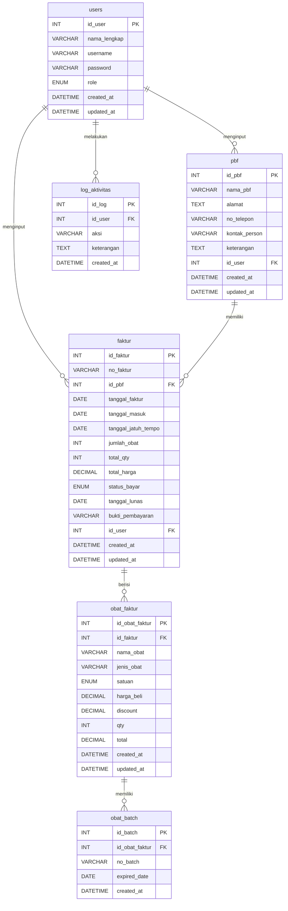

# PRD v3.0 — Part 2: Database, Diagram & Activity Diagram

---

## 5. Struktur Database

Database menggunakan **6 tabel utama:**

| No | Nama Tabel | Keterangan |
|----|------------|------------|
| 1 | `users` | Data pengguna sistem |
| 2 | `pbf` | Data PBF (mitra pemasok) — menu sendiri |
| 3 | `faktur` | Header faktur/invoice pembelian |
| 4 | `obat_faktur` | Detail obat per faktur |
| 5 | `obat_batch` | Data batch & exp date per unit obat |
| 6 | `log_aktivitas` | Riwayat seluruh aktivitas user |

> **CATATAN:** Tabel `obat_expired` (manual) **DIHAPUS**. Laporan expired sekarang otomatis dari `obat_batch`. Tabel `piutang` **DIHAPUS** — piutang otomatis dari tabel `faktur` + kolom status & bukti bayar.

---

## 6. Struktur Tabel Database

### 6.1 Tabel `users` (Tidak berubah)

| Field | Tipe Data | Keterangan |
|-------|-----------|------------|
| id_user | INT (PK, AI) | ID user |
| nama_lengkap | VARCHAR(100) | Nama lengkap |
| username | VARCHAR(50) UNIQUE | Username login |
| password | VARCHAR(255) | Password (hashed) |
| role | ENUM('super_admin','admin') | Hak akses |
| created_at | DATETIME | Tanggal dibuat |
| updated_at | DATETIME | Tanggal diupdate |

### 6.2 Tabel `pbf` (Diperluas — menu sendiri)

| Field | Tipe Data | Keterangan |
|-------|-----------|------------|
| id_pbf | INT (PK, AI) | ID PBF |
| nama_pbf | VARCHAR(100) | Nama PBF |
| alamat | TEXT | Alamat PBF |
| no_telepon | VARCHAR(20) | Nomor telepon |
| kontak_person | VARCHAR(100) | Nama kontak |
| keterangan | TEXT | Catatan tambahan |
| id_user | INT (FK → users) | User yang input |
| created_at | DATETIME | Tanggal dibuat |
| updated_at | DATETIME | Tanggal diupdate |

### 6.3 Tabel `faktur` (BARU — header invoice)

| Field | Tipe Data | Keterangan |
|-------|-----------|------------|
| id_faktur | INT (PK, AI) | ID faktur |
| no_faktur | VARCHAR(100) UNIQUE | Nomor faktur |
| id_pbf | INT (FK → pbf) | PBF asal |
| tanggal_faktur | DATE | Tanggal faktur |
| tanggal_masuk | DATE | Tanggal barang masuk |
| tanggal_jatuh_tempo | DATE | Tenggat bayar |
| jumlah_obat | INT | Jumlah jenis obat |
| total_qty | INT | Total qty seluruh obat |
| total_harga | DECIMAL(15,2) | Total harga faktur |
| status_bayar | ENUM('belum_lunas','lunas') DEFAULT 'belum_lunas' | Status piutang |
| tanggal_lunas | DATE NULL | Tanggal pelunasan |
| bukti_pembayaran | VARCHAR(255) NULL | Path foto bukti bayar |
| id_user | INT (FK → users) | User yang input |
| created_at | DATETIME | Tanggal dibuat |
| updated_at | DATETIME | Tanggal diupdate |

### 6.4 Tabel `obat_faktur` (BARU — detail obat per faktur)

| Field | Tipe Data | Keterangan |
|-------|-----------|------------|
| id_obat_faktur | INT (PK, AI) | ID item |
| id_faktur | INT (FK → faktur) | Relasi ke faktur |
| nama_obat | VARCHAR(100) | Nama obat |
| jenis_obat | VARCHAR(100) | Jenis obat |
| satuan | ENUM('Tube','FLS','Strip','Sach','Box','Kaleng','Pcs','Tablet','Kapsul','Ampul','Supp','Ovula','Pack') | Satuan |
| harga_beli | DECIMAL(12,2) | Harga beli |
| discount | DECIMAL(12,2) DEFAULT 0 | Potongan harga |
| qty | INT | Jumlah obat |
| total | DECIMAL(12,2) | (harga_beli - discount) × qty |
| created_at | DATETIME | Tanggal dibuat |
| updated_at | DATETIME | Tanggal diupdate |

### 6.5 Tabel `obat_batch` (BARU — batch & exp per unit)

| Field | Tipe Data | Keterangan |
|-------|-----------|------------|
| id_batch | INT (PK, AI) | ID batch |
| id_obat_faktur | INT (FK → obat_faktur) | Relasi ke obat |
| no_batch | VARCHAR(50) | Nomor batch produksi |
| expired_date | DATE | Tanggal kedaluwarsa |
| created_at | DATETIME | Tanggal dibuat |

### 6.6 Tabel `log_aktivitas` (Diperluas — catat SEMUA)

| Field | Tipe Data | Keterangan |
|-------|-----------|------------|
| id_log | INT (PK, AI) | ID log |
| id_user | INT (FK → users) | User pelaku |
| aksi | VARCHAR(100) | Jenis aksi |
| keterangan | TEXT | Detail lengkap |
| created_at | DATETIME | Waktu kejadian |

---

## 7. ERD (Entity Relationship Diagram)



---

## 8. Use Case Diagram

### Aktor:
- **Super Admin** (Apoteker)
- **Admin** (Asisten Apoteker)

```
┌────────────────────────────────────────────────────────────────┐
│                        SISTEM APOTEK                           │
│                                                                │
│   ┌──────────────────┐                                         │
│   │  Login            │◄──────── Super Admin & Admin           │
│   └──────────────────┘                                         │
│                                                                │
│   ┌──────────────────┐                                         │
│   │  Dashboard        │◄──────── Super Admin & Admin           │
│   │  (Ringkasan +     │          (isi berbeda per role)        │
│   │   Selengkapnya)   │                                        │
│   └──────────────────┘                                         │
│                                                                │
│   ┌──────────────────┐                                         │
│   │  Manajemen PBF    │◄──────── Super Admin SAJA              │
│   └──────────────────┘                                         │
│                                                                │
│   ┌──────────────────┐                                         │
│   │  Manajemen Stok   │◄──────── Super Admin & Admin           │
│   │  (Invoice-Based)  │          (Hapus: Super Admin saja)     │
│   └──────────────────┘                                         │
│                                                                │
│   ┌──────────────────┐                                         │
│   │  Piutang          │◄──────── Super Admin SAJA              │
│   │  (Otomatis Faktur)│                                        │
│   └──────────────────┘                                         │
│                                                                │
│   ┌──────────────────┐                                         │
│   │  Laporan Expired  │◄──────── Super Admin SAJA              │
│   │  (Otomatis)       │                                        │
│   └──────────────────┘                                         │
│                                                                │
│   ┌──────────────────┐                                         │
│   │  Kelola Akun      │◄──────── Super Admin SAJA              │
│   └──────────────────┘                                         │
│                                                                │
│   ┌──────────────────┐                                         │
│   │  Log Aktivitas    │◄──────── Super Admin & Admin           │
│   └──────────────────┘                                         │
│                                                                │
│   ┌──────────────────┐                                         │
│   │  Logout           │◄──────── Super Admin & Admin           │
│   └──────────────────┘                                         │
└────────────────────────────────────────────────────────────────┘
```

**Detail Use Case per Aktor:**

```
Super Admin (Apoteker)
    ├── Login / Logout
    ├── Dashboard (Ringkasan + Selengkapnya)
    ├── Manajemen PBF (CRUD PBF)
    ├── Manajemen Stok (CRUD Faktur + Obat + Batch)
    ├── Piutang (Lihat, Lunasi, Upload Bukti, Export)
    ├── Laporan Expired (Lihat otomatis, Filter)
    ├── Kelola Akun Admin (CRUD Admin)
    └── Log Aktivitas (Lihat semua log)

Admin (Asisten Apoteker)
    ├── Login / Logout
    ├── Dashboard (Ringkasan terbatas + Selengkapnya)
    ├── Manajemen Stok (Tambah/Edit Faktur + Obat, tanpa Hapus)
    └── Log Aktivitas (Lihat log)
```

---

## 9. SQL Schema

```sql
CREATE DATABASE IF NOT EXISTS apotek_ananda;
USE apotek_ananda;

CREATE TABLE users (
    id_user INT AUTO_INCREMENT PRIMARY KEY,
    nama_lengkap VARCHAR(100) NOT NULL,
    username VARCHAR(50) NOT NULL UNIQUE,
    password VARCHAR(255) NOT NULL,
    role ENUM('super_admin', 'admin') NOT NULL DEFAULT 'admin',
    created_at DATETIME DEFAULT CURRENT_TIMESTAMP,
    updated_at DATETIME DEFAULT CURRENT_TIMESTAMP ON UPDATE CURRENT_TIMESTAMP
);

INSERT INTO users (nama_lengkap, username, password, role)
VALUES ('Apoteker', 'superadmin', '$2y$10$hashed_password_here', 'super_admin');

CREATE TABLE pbf (
    id_pbf INT AUTO_INCREMENT PRIMARY KEY,
    nama_pbf VARCHAR(100) NOT NULL,
    alamat TEXT,
    no_telepon VARCHAR(20),
    kontak_person VARCHAR(100),
    keterangan TEXT,
    id_user INT NOT NULL,
    created_at DATETIME DEFAULT CURRENT_TIMESTAMP,
    updated_at DATETIME DEFAULT CURRENT_TIMESTAMP ON UPDATE CURRENT_TIMESTAMP,
    FOREIGN KEY (id_user) REFERENCES users(id_user) ON DELETE CASCADE
);

CREATE TABLE faktur (
    id_faktur INT AUTO_INCREMENT PRIMARY KEY,
    no_faktur VARCHAR(100) NOT NULL UNIQUE,
    id_pbf INT NOT NULL,
    tanggal_faktur DATE NOT NULL,
    tanggal_masuk DATE NOT NULL,
    tanggal_jatuh_tempo DATE NOT NULL,
    jumlah_obat INT NOT NULL DEFAULT 0,
    total_qty INT NOT NULL DEFAULT 0,
    total_harga DECIMAL(15,2) NOT NULL DEFAULT 0,
    status_bayar ENUM('belum_lunas','lunas') NOT NULL DEFAULT 'belum_lunas',
    tanggal_lunas DATE NULL,
    bukti_pembayaran VARCHAR(255) NULL,
    id_user INT NOT NULL,
    created_at DATETIME DEFAULT CURRENT_TIMESTAMP,
    updated_at DATETIME DEFAULT CURRENT_TIMESTAMP ON UPDATE CURRENT_TIMESTAMP,
    FOREIGN KEY (id_pbf) REFERENCES pbf(id_pbf) ON DELETE CASCADE,
    FOREIGN KEY (id_user) REFERENCES users(id_user) ON DELETE CASCADE
);

CREATE TABLE obat_faktur (
    id_obat_faktur INT AUTO_INCREMENT PRIMARY KEY,
    id_faktur INT NOT NULL,
    nama_obat VARCHAR(100) NOT NULL,
    jenis_obat VARCHAR(100),
    satuan ENUM('Tube','FLS','Strip','Sach','Box','Kaleng','Pcs','Tablet','Kapsul','Ampul','Supp','Ovula','Pack') NOT NULL,
    harga_beli DECIMAL(12,2) NOT NULL DEFAULT 0,
    discount DECIMAL(12,2) NOT NULL DEFAULT 0,
    qty INT NOT NULL DEFAULT 0,
    total DECIMAL(12,2) NOT NULL DEFAULT 0,
    created_at DATETIME DEFAULT CURRENT_TIMESTAMP,
    updated_at DATETIME DEFAULT CURRENT_TIMESTAMP ON UPDATE CURRENT_TIMESTAMP,
    FOREIGN KEY (id_faktur) REFERENCES faktur(id_faktur) ON DELETE CASCADE
);

CREATE TABLE obat_batch (
    id_batch INT AUTO_INCREMENT PRIMARY KEY,
    id_obat_faktur INT NOT NULL,
    no_batch VARCHAR(50) NOT NULL,
    expired_date DATE NOT NULL,
    created_at DATETIME DEFAULT CURRENT_TIMESTAMP,
    FOREIGN KEY (id_obat_faktur) REFERENCES obat_faktur(id_obat_faktur) ON DELETE CASCADE
);

CREATE TABLE log_aktivitas (
    id_log INT AUTO_INCREMENT PRIMARY KEY,
    id_user INT NOT NULL,
    aksi VARCHAR(100) NOT NULL,
    keterangan TEXT NOT NULL,
    created_at DATETIME DEFAULT CURRENT_TIMESTAMP,
    FOREIGN KEY (id_user) REFERENCES users(id_user) ON DELETE CASCADE
);

-- INDEXES
CREATE INDEX idx_pbf_nama ON pbf(nama_pbf);
CREATE INDEX idx_faktur_no ON faktur(no_faktur);
CREATE INDEX idx_faktur_pbf ON faktur(id_pbf);
CREATE INDEX idx_faktur_status ON faktur(status_bayar);
CREATE INDEX idx_faktur_jatuh_tempo ON faktur(tanggal_jatuh_tempo);
CREATE INDEX idx_obat_faktur ON obat_faktur(id_faktur);
CREATE INDEX idx_obat_nama ON obat_faktur(nama_obat);
CREATE INDEX idx_batch_exp ON obat_batch(expired_date);
CREATE INDEX idx_batch_obat ON obat_batch(id_obat_faktur);
```

---

## 10. Struktur Direktori Proyek (Revisi)

```
apotek-ananda/
├── backend/
│   ├── config/
│   │   └── database.php
│   ├── controllers/
│   │   ├── auth_controller.php
│   │   ├── pbf_controller.php          # BARU: CRUD PBF
│   │   ├── faktur_controller.php       # BARU: CRUD Faktur + Obat + Batch
│   │   ├── piutang_controller.php      # REVISI: pelunasan dari faktur
│   │   ├── expired_controller.php      # REVISI: query otomatis saja
│   │   ├── admin_controller.php
│   │   └── log_controller.php
│   ├── models/
│   │   ├── user.php
│   │   ├── pbf.php                     # BARU
│   │   ├── faktur.php                  # BARU
│   │   ├── obat_faktur.php             # BARU
│   │   ├── obat_batch.php              # BARU
│   │   └── log_aktivitas.php
│   └── helpers/
│       ├── session_helper.php
│       └── export_helper.php
├── frontend/
│   ├── assets/
│   │   ├── css/style.css
│   │   ├── js/script.js
│   │   └── images/
│   ├── templates/
│   │   ├── header.php
│   │   ├── sidebar.php
│   │   └── footer.php
│   ├── auth/
│   │   └── login.php
│   ├── superadmin/
│   │   ├── dashboard.php
│   │   ├── manajemen_pbf.php           # BARU: menu PBF sendiri
│   │   ├── manajemen_stok.php          # REVISI: tabel faktur
│   │   ├── tambah_faktur.php           # BARU: screen tambah faktur
│   │   ├── detail_faktur.php           # BARU: screen detail faktur
│   │   ├── piutang.php                 # REVISI: pelunasan otomatis
│   │   ├── laporan_expired.php         # REVISI: otomatis saja
│   │   ├── kelola_admin.php
│   │   └── log_aktivitas.php
│   └── admin/
│       ├── dashboard.php
│       ├── manajemen_stok.php
│       ├── tambah_faktur.php           # BARU
│       ├── detail_faktur.php           # BARU
│       └── log_aktivitas.php
├── uploads/
│   └── bukti_bayar/                    # Folder foto bukti pembayaran
├── exports/
├── index.php
└── logout.php
```

---

## 11. Teknologi yang Digunakan

| Komponen | Teknologi |
|----------|-----------|
| Frontend | HTML, CSS, JavaScript |
| Backend | PHP (Native) |
| Database | MySQL |
| Server | Apache (Laragon) |
| Export | PhpSpreadsheet (Excel), DomPDF (PDF) |
| Hashing | PHP `password_hash()` / bcrypt |
