# PRD v3.0 — Part 3: Activity Diagrams Lengkap

---

## Activity Diagram 1 — Login

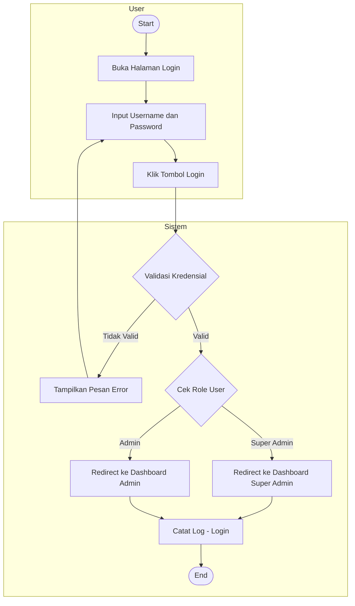

---

## Activity Diagram 2 — Logout

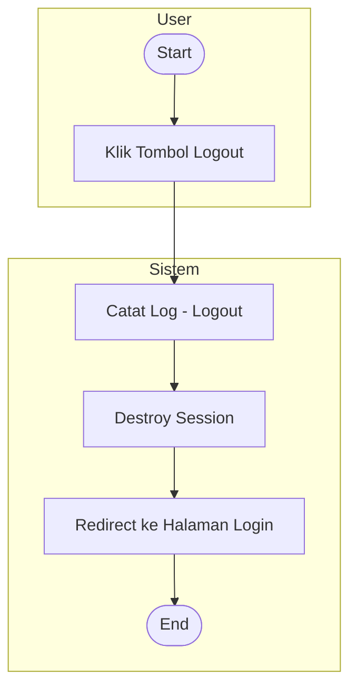

---

## Activity Diagram 3 — Dashboard

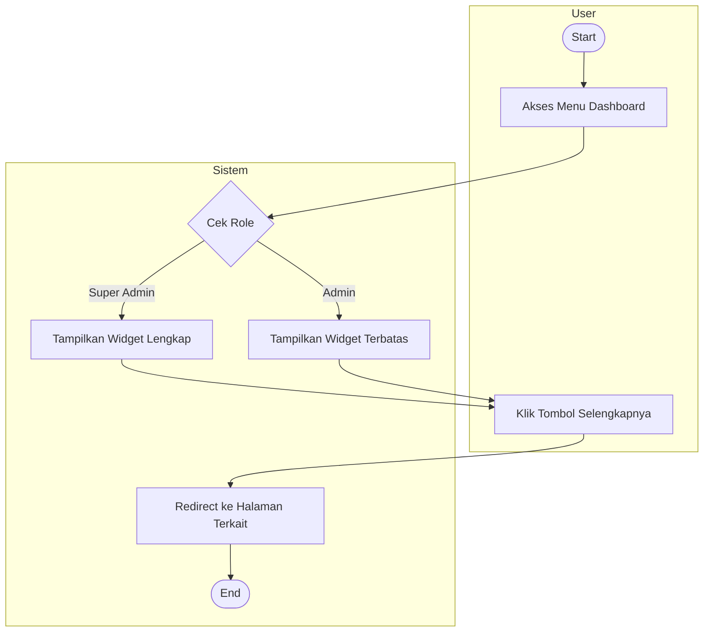

---

## Activity Diagram 4 — Manajemen PBF

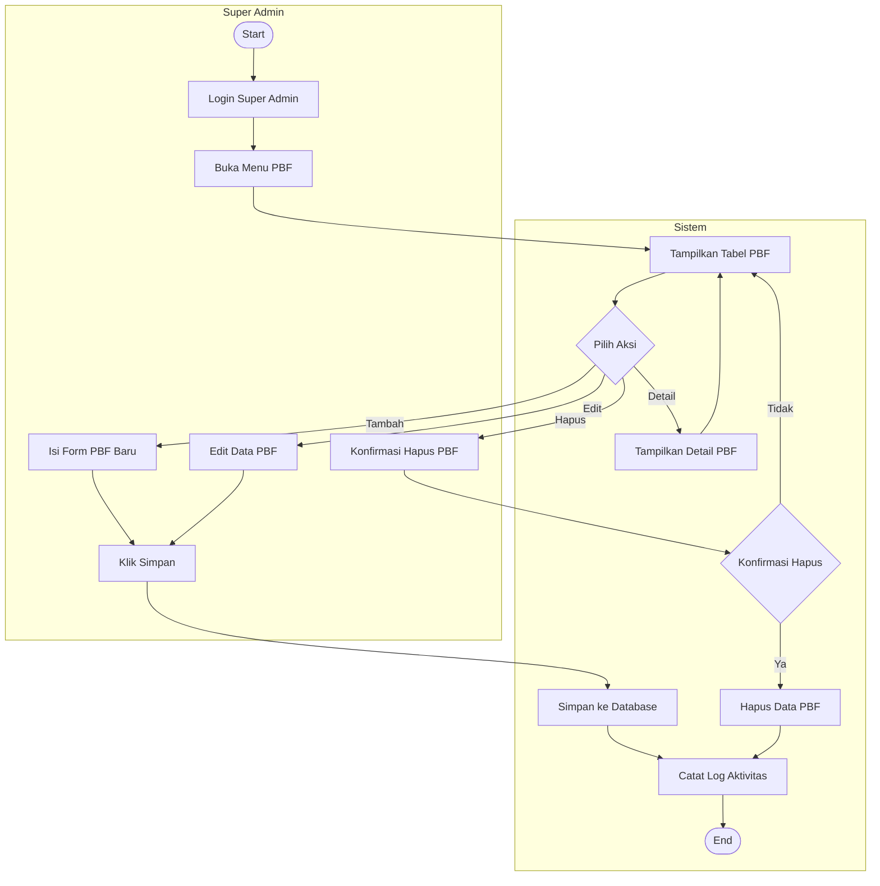

---

## Activity Diagram 5 — Lihat Daftar Faktur

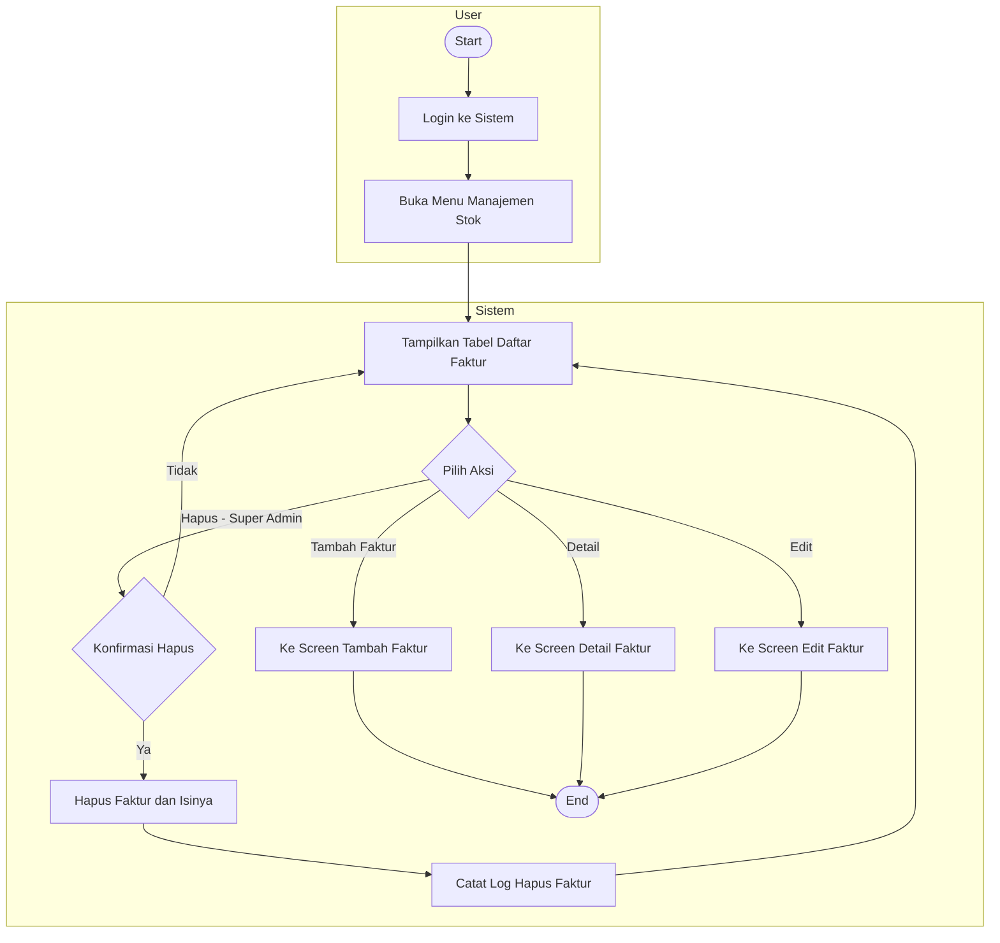

---

## Activity Diagram 6 — Tambah Faktur Baru

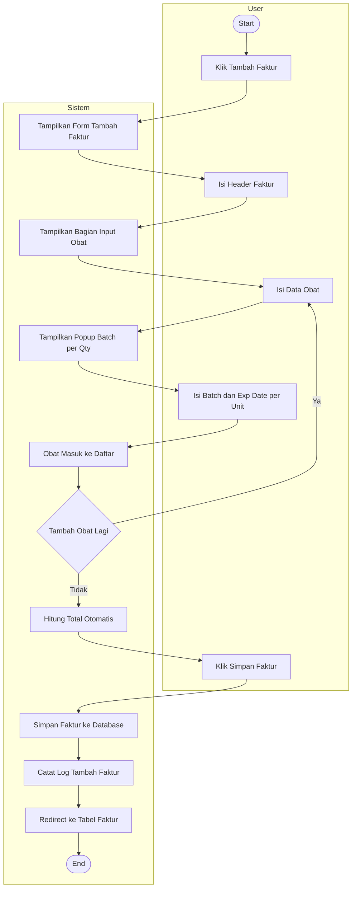

---

## Activity Diagram 7 — Detail Faktur

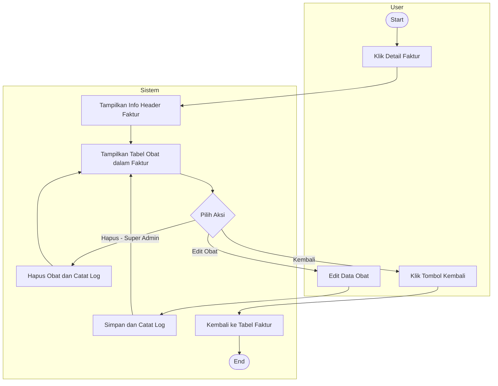

---

## Activity Diagram 8 — Piutang

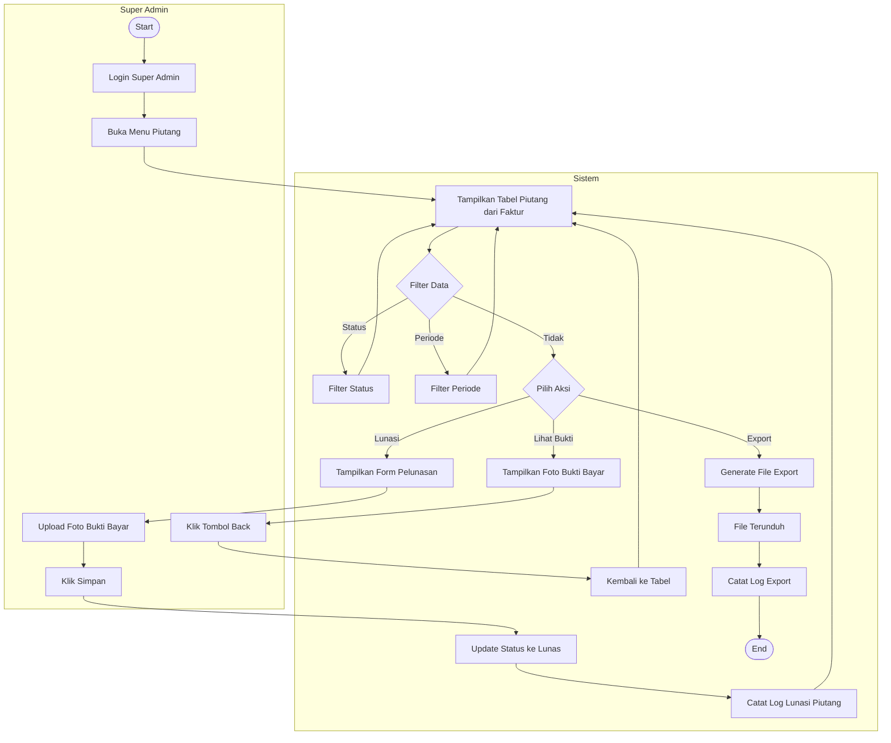

---

## Activity Diagram 9 — Laporan Expired Otomatis

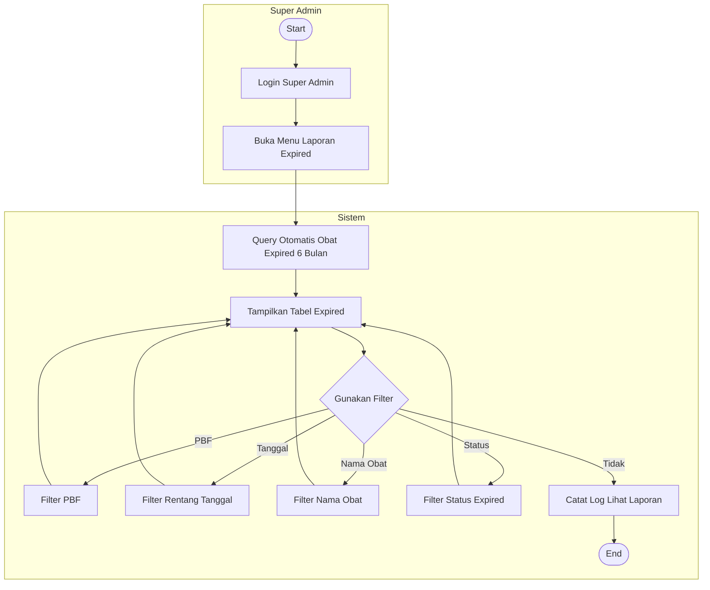

---

## Activity Diagram 10 — Kelola Akun Admin

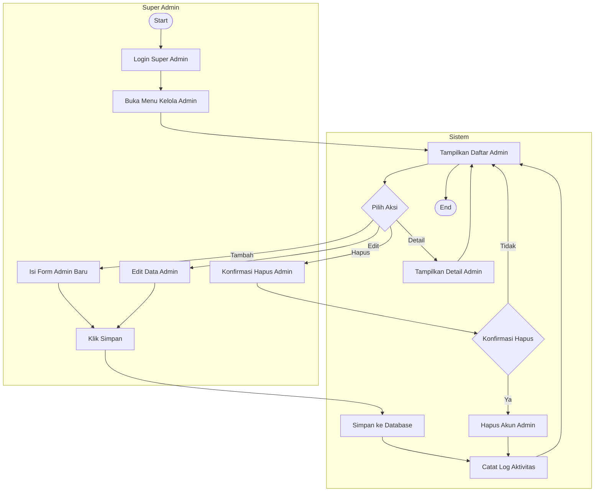

---

## Activity Diagram 11 — Log Aktivitas

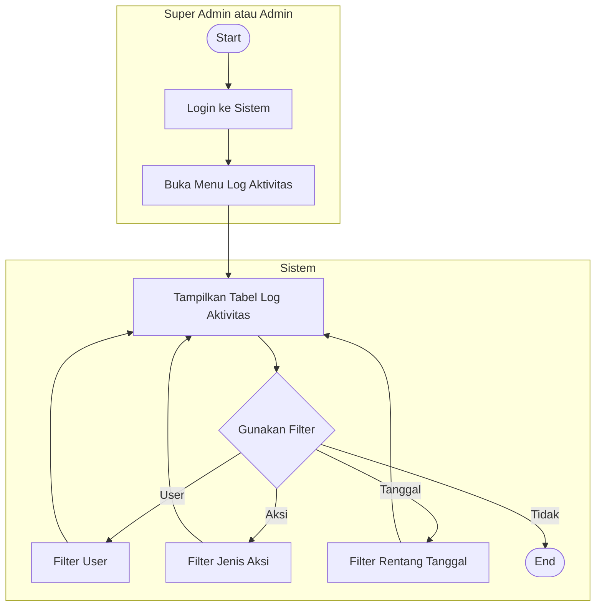

---

## Ringkasan Perubahan v2.9 ke v3.0

| No | Perubahan | Detail |
|----|-----------|--------|
| 1 | PBF jadi menu sidebar sendiri | Super Admin only, info lengkap mitra pemasok |
| 2 | Manajemen Stok menjadi Invoice-Based | Obat dibungkus dalam faktur, screen baru |
| 3 | Tabel faktur baru | Header invoice dengan status bayar |
| 4 | Tabel obat_faktur baru | Detail obat per faktur |
| 5 | Tabel obat_batch baru | Batch dan exp date per unit obat |
| 6 | Piutang otomatis dari faktur | Tinggal lunasi dan upload bukti |
| 7 | Laporan Expired otomatis saja | Query otomatis dari obat_batch |
| 8 | Hapus tabel obat_expired | Tidak diperlukan lagi |
| 9 | Hapus tabel piutang | Digabung ke faktur via status_bayar |
| 10 | Hapus tabel stok_masuk | Diganti obat_faktur dan obat_batch |
| 11 | Log Aktivitas catat semua aksi | Termasuk lihat, filter, export |
| 12 | Dashboard plus tombol Selengkapnya | Ringkasan saja, klik untuk detail |
